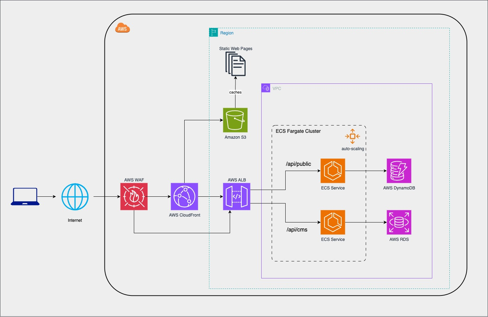

# System Architecture (C4 Model)

# System Context

# Container

We have distinguished the following technical components:

- A frontend that is designed as a static website that will show the content in an
  appealing and user friendly way.
- A REST API that will work as the backend for the whole system, storing and retrieving
  data.
- Another static frontend that will require users to be logged in to add, edit and delete
  news articles that will be shown via the first App.

These URLs are the ones for each application:

https://www.newsnow.com/ → public frontend application 
https://www.newsnow.com/cms → CMS frontend application (authentication required) 
https://www.newsnow.com/api/public → backend API for the public frontend 
https://www.newsnow.com/api/cms → backend API for the CMS frontend (authentication required)

The REST API can be just a single backend application but we could run into problems in the future, especially when influencers notify their followers about new content on the platform:

- Limited Scalability: requiring the entire application to scale even if only one component needs resources, which can be costly.
- Poor Reliability: a single component failure can bring down the entire application.
- Tight coupling between services.

Even a single database could create bottlenecks, slowing down database operations, degrading application performance… potentially affecting both frontend applications even though it should only affect one part of the system.

Multiple databases can bring multiple benefits like having an engine optimized for the read-intensive public web (read model with document database like MongoDB, DynamoDB or even PostgreSQL with his JSONB support). On the other hand, having a relational database for managing the news articles and other influencer-related information (write model with a PostgreSQL) might be a better option. CQRS to the rescue.

DynamoDB tables can often respond to user requests with single digit millisecond latency across workloads. If this becomes a latency issue, we can cache the data in an ElastiCache (in-memory database for high performance) so we'll save that for later.

:information_source: For simplicity and because this is an MVP, I would start as simple as possible, with a monolithic backend application and postpone addressing these risks in the future, when they actually become problems. But let's assume we're already at that point.

When some data is changed (a new article, a modification or a delete) in the CMS application, it publishes an event to notify the other application to keep the data synchronized between each datastore. This way we loss strong consistency so we’ll have eventual consistency but we gain scalability and less coupling between applications as each one has very different purposes and use cases.

# Deployment

Frontend applications should be static web applications, they should all be rendered on the client side, not the server side. Also, we can host the web files generated in S3 and use AWS CloudFront to distribute the content that serves the content on the edge of the location of the user.

For deployment and scalability management of the backend API I would start with a solution like AWS Elastic Beanstalk because it’s easier to get started with and allows us to focus on the business. Get our applications from code to production quickly and we can still use Fargate ECS with the ability to configure autoscaling to create automatically new instances of the backend if needed, when higher traffic peaks are generated.

